# Auditoria de cierre: flujo integral de partidos

Fecha de validacion: 3 de septiembre de 2026.

## Resultado

El flujo oficial queda organizado como una secuencia continua y responsive:

```mermaid
flowchart LR
  A[Configurar<br/>tipo, agenda y cancha] --> B[Convocar<br/>sin limite artificial de invitaciones]
  B --> C[Confirmar y enviar]
  C --> D{Acepta un jugador}
  D -->|Hay menos de 10 confirmados| E[Cupo confirmado]
  D -->|Ya hay 10 confirmados| F[Lista de espera FIFO]
  E --> G{Se libera un cupo}
  F --> G
  G -->|Hay espera| H[Promover primer jugador elegible]
  E --> I[10 confirmados]
  H --> I
  I --> J[Iniciar partido]
  J --> K[Registrar y confirmar eventos]
  K --> L[Cerrar: marcador y resumen]
  L --> M[Finalizar transaccion]
  M --> N[Historial + XP + OVR/rating]
  N --> O[Ranking y logros]
  M --> P[Votacion MVP por 3 horas]
  P --> Q[Resultado MVP]
```

## Reglas verificadas

| Requisito | Comportamiento consolidado | Evidencia automatizada |
| --- | --- | --- |
| Creacion simple | Wizard unico de 3 pasos: Configurar, Convocar y Confirmar. | Playwright `08-match-flow-captures.spec.ts`; pruebas Angular. |
| Sobrecupo | Se pueden enviar mas invitaciones que cupos. Los primeros 10 elegibles que aceptan quedan confirmados. | `MatchRosterPolicyTest`, `SocialServiceTest`, `MatchInviteConcurrencyIntegrationTest`. |
| Lista de espera | Quien acepta despues del cupo 10 pasa a espera FIFO. Al liberar un cupo se omiten entradas obsoletas y se promueve al primer elegible. | `SocialServiceTest` y prueba de concurrencia con base H2. |
| Inicio | El creador cuenta una sola vez, incluso con datos heredados, y solo se inicia al completar el minimo real de la modalidad. | `MatchRosterPolicyTest`, `MatchServiceTest`, `MatchControllerIntegrationTest`. |
| Cierre | Solo un responsable autorizado cierra un partido iniciado; eventos pendientes y marcador se consolidan antes de finalizar. | `MatchRatingIntegrationTest`, `MatchPendingEventClosureServiceTest`, `MatchFinalScoreServiceTest`. |
| XP e historial | Cada confirmado genera una fila inmutable y suma XP a la posicion usada, una sola vez. | `MatchPlayerHistoryServiceTest`, repositorio de historial. |
| OVR y ranking | La finalizacion actualiza ratings; el ranking consume esos valores y soporta calculo por lote. | `MatchPostMatchRatingServiceTest`, `RatingServiceTest`, pruebas de leaderboard. |
| Logros | Goles, asistencias, partidos, victorias y partidos creados se calculan desde datos finalizados y auditables. | `PlayerAchievementService` y contrato HTTP de perfil. |
| MVP | Solo participantes confirmados pueden votar; ventana de 3 horas y cierre automatico al completar votos. | `MatchMvpServiceTest` y captura Playwright de votacion. |
| Record de equipo | Solo enfrentamientos contra otro equipo afectan el record competitivo; internos se muestran como actividad, no como victoria competitiva. | `TeamLeaderboardServiceTest`. |
| Navegacion | Detalle, cierre y MVP conservan la barra inferior y el contexto de Partidos. | Capturas 04, 05 y 06. |
| Notificaciones | La insignia cuenta solo invitaciones accionables, muestra `9+`, los avisos se deduplican, la cola se limita y el toast no tapa el encabezado. | `NotificationBadgeService` y `NotificationService` (5 pruebas combinadas). |

## Evidencia visual

- [01 - Configurar partido](flow-captures/01-configurar-partido-mobile.png)
- [02 - Convocar con sobrecupo 11/10](flow-captures/02-convocar-sobrecupo-mobile.png)
- [03 - Confirmar convocatoria](flow-captures/03-confirmar-convocatoria-mobile.png)
- [04 - Partido confirmado con 10/10](flow-captures/04-partido-confirmado-mobile.png)
- [05 - Cierre del partido](flow-captures/05-cierre-partido-mobile.png)
- [06 - Votacion de Jugador del Partido](flow-captures/06-votacion-mvp-desktop.png)

## Validacion ejecutada

- Backend: 77 suites, 673 pruebas, 0 fallos, 0 errores (32 omitidas por perfil/condicion).
- Frontend: 181 pruebas unitarias, 181 correctas.
- Playwright visual: 3 recorridos, 3 correctos.
- Compilacion Angular development: correcta.
- Inventario Playwright: 13 pruebas compiladas en 8 archivos.
- `git diff --check`: sin errores de espacios ni conflictos.

El smoke real de MVP ya no fabrica un partido invalido de dos jugadores. Requiere `E2E_FINALIZED_MATCH_ID` apuntando a un partido finalizado donde el usuario B sea participante confirmado; la cobertura visual determinista y la cobertura de negocio del backend permanecen disponibles sin depender de datos mutables.
