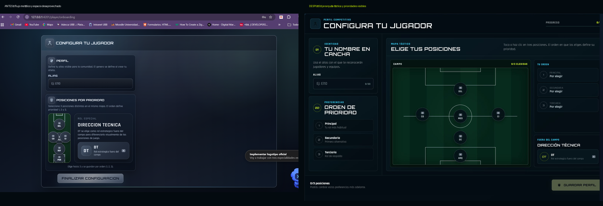

# Auditoría y plan de reestructuración visual

Fecha: 2026-07-23  
Alcance implementado: configuración inicial del jugador.

## Antes y después

## Diagnóstico del flujo anterior

1. **Jerarquía y uso del espacio — crítico**
   - El formulario ocupaba menos de la mitad de la tarjeta y dejaba un gran vacío en escritorio.
   - El campo era demasiado pequeño para comprender o pulsar posiciones con seguridad.
   - DT competía visualmente con las posiciones principales.

2. **Comprensión de prioridades — necesita atención**
   - El texto explicaba el orden 1, 2 y 3, pero el usuario no tenía una confirmación persistente y legible.
   - Los errores aparecían como mensajes separados para cada prioridad.

3. **Interacción mouse/táctil — necesita atención**
   - Los nodos eran utilizables, pero el mapa estrecho reducía la precisión.
   - Faltaba una relación visual directa entre nodo elegido, prioridad y resumen.

4. **Consistencia con el editor de equipos — crítico**
   - El gris metálico, los gradientes y la estructura de tarjetas no coincidían con el lenguaje táctico aprobado.
   - La pantalla se percibía como otro producto.

5. **Ruta de revisión — resuelto**
   - La pantalla tenía modo `demo`, pero el guard redirigía a usuarios con onboarding completo.
   - `player/onboarding?demo=1` ahora permite revisar el estado sin modificar el perfil real.

## Modificación implementada

- Shell oscuro grafito con acentos lima y cian.
- Campo ampliado como elemento central.
- Resumen de prioridad principal, secundaria y terciaria en tiempo real.
- Nodos con nombre corto, estado disponible/seleccionado y número de prioridad.
- DT separado del campo, pero dentro del mismo flujo de selección.
- Alias y progreso general visibles sin competir con el mapa.
- CTA “Guardar perfil” desactivado hasta cumplir alias + tres posiciones.
- Error consolidado y mostrado solo después de intentar guardar.
- Breakpoint móvil de una columna, objetivos táctiles de 52 px y CTA fijo al borde inferior.

## Rutas y procesos recomendados

1. **Acceso → registro → onboarding — prioridad P0**
   - Unificar login y registro con este mismo sistema visual.
   - Después de crear cuenta, iniciar sesión automáticamente y enviar directo a onboarding.
   - Después de guardar el perfil, recomendar `/home` con confirmación de éxito en vez de terminar en `/player/profile`.

2. **Crear partido → invitar → armar equipos — prioridad P0**
   - Convertir el proceso en una secuencia visible: datos, convocatoria, alineación y confirmación.
   - Reutilizar el mismo mapa táctico y los mismos estados de selección.
   - Mantener `/matches/create` como entrada y evitar rutas paralelas para el mismo objetivo.

3. **Partido activo → cierre → MVP — prioridad P1**
   - Consolidar estado, marcador y eventos bajo una cabecera común.
   - Mostrar el siguiente paso disponible según estado del partido.
   - Mantener las rutas actuales de cierre y MVP, pero reforzar continuidad y retorno al detalle.

4. **Social, invitaciones y equipos — prioridad P1**
   - Mantener `/social` como contenedor principal y usar pestañas/estado de URL para amigos, invitaciones y equipos.
   - Tratar `/invitations` como acceso compatible, no como experiencia separada.

5. **Ranking, estadísticas y perfil — prioridad P2**
   - Mantener `/leaderboard` como ruta canónica y `/ranking` como redirección.
   - Integrar `/stats` dentro del perfil o enlazarlo como vista analítica secundaria.
   - Aplicar tarjetas compactas, métricas con acento y tipografía del nuevo sistema.

6. **Rutas de sistema — prioridad P1**
   - Agregar una ruta `**` con pantalla 404 y recuperación a inicio.
   - Estandarizar estados de carga, vacío, error y reintento.
   - Documentar rutas canónicas para evitar duplicados accidentales.

## Orden propuesto de implementación

1. Autenticación y registro.
2. Inicio y navegación global.
3. Creación de partido e invitaciones.
4. Detalle, cierre y votación MVP.
5. Social, equipos y ranking.
6. Perfil y estadísticas.
7. Limpieza final de componentes metálicos ya reemplazados.

## Archivos visuales

- `01-before-onboarding.png`: estado anterior.
- `02-design-language-target.png`: lenguaje visual aprobado.
- `04-after-live-desktop-crop.png`: resultado implementado.
- `05-after-live-mobile.png`: validación del breakpoint móvil.
- `06-before-after.png`: comparación consolidada.
