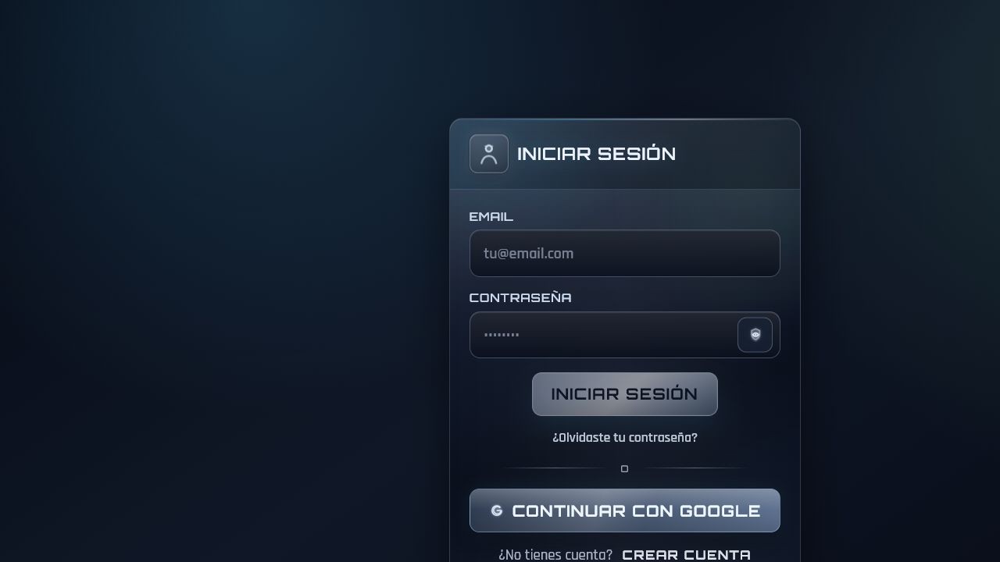
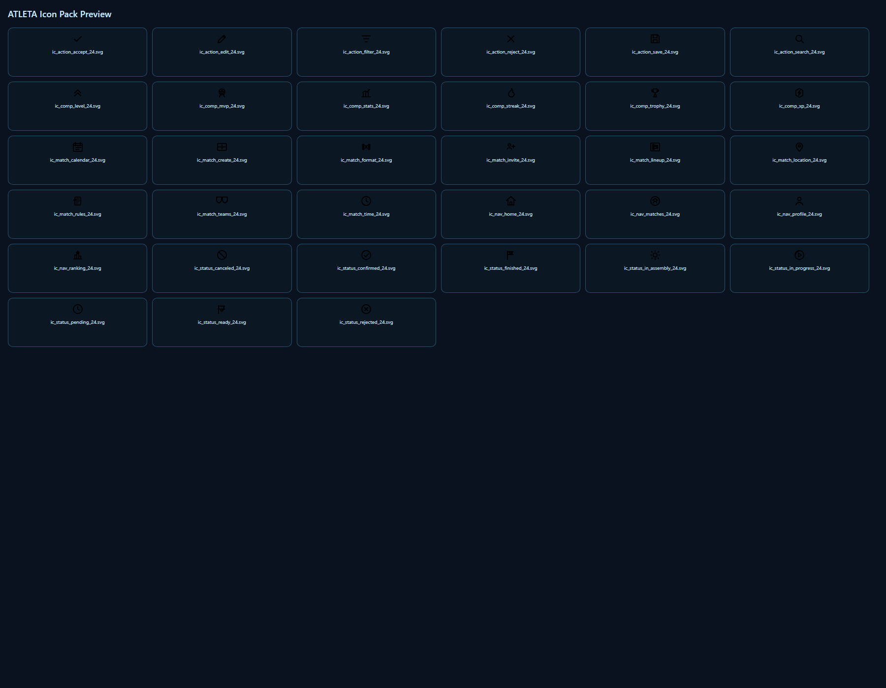

# Inventario iconográfico de Atleta — Etapa 1

Fecha de revisión: 21 de julio de 2026

## Alcance

Esta etapa identifica los iconos presentes en `src/assets/icons/atleta`, verifica cuáles están referenciados por la aplicación y describe el significado que adquieren en cada contexto. También registra pictogramas Unicode usados como iconos. La revisión visual directa se limitó a la pantalla pública de acceso; las pantallas protegidas se analizaron desde sus plantillas y componentes porque no había credenciales E2E configuradas.

## Resumen ejecutivo

- Biblioteca propia: **36 SVG**.
- SVG usados por la aplicación: **32**.
- SVG disponibles pero sin uso: **4** (`action_reject`, `comp_mvp`, `match_time`, `status_rejected`).
- La aplicación ya no usa Ionicons externos por nombre; valores heredados como `trophy-outline` funcionan sólo como claves internas y se traducen a SVG propios.
- La lámina `preview-icons.png` muestra **33 iconos** y está desactualizada: omite `action_view`, `action_hide` y `brand_google`.
- Se mantienen iconos Unicode/emoji fuera del sistema visual: balón, objetivo, círculos de resultado, flecha de nivel, check, estrellas y controles `+`/`−`.
- El principal riesgo semántico es la reutilización de un mismo símbolo para conceptos diferentes, especialmente nivel/estrella, estadísticas, trofeo, búsqueda y estados.

## Evidencia visual

### 1. Acceso — salud general: buena con observaciones

Se observan tres significados coherentes: perfil/identidad en el título, mostrar u ocultar contraseña en el campo y marca Google en el acceso federado. El tamaño y el lenguaje visual son consistentes. El control de contraseña sí tiene nombre accesible dinámico. Como riesgo menor, el icono de perfil se reutiliza para autenticación, registro, onboarding y seguridad; funciona, pero pierde especificidad.

### 2. Biblioteca propia — salud general: consistente, inventario visual desactualizado

El set mantiene un contenedor visual común, trazo redondeado y base de 24 px. La previsualización no representa el inventario completo y varios símbolos comparten la misma silueta exterior de escudo, lo que reduce su diferenciación rápida a tamaño pequeño.

## Inventario de SVG propios

### Acciones

| Icono | Significado previsto | Uso real dentro de Atleta | Estado y observación |
|---|---|---|---|
| `ic_action_accept_24.svg` | Aceptar / confirmar | Confirmación final del asistente de creación de partido | Usado; claro |
| `ic_action_edit_24.svg` | Editar / ajustar | Datos de perfil y registro, edición de partido, acciones del detalle y ajuste del cierre | Usado; coherente, aunque muy extendido |
| `ic_action_filter_24.svg` | Filtrar | Filtros del hub de partidos | Usado; claro |
| `ic_action_hide_24.svg` | Ocultar contenido | Ocultar contraseña | Usado; claro y con etiqueta accesible |
| `ic_action_reject_24.svg` | Rechazar / cerrar | Sin referencias | **Sin uso**; reservar para rechazar invitaciones o retirar |
| `ic_action_save_24.svg` | Guardar | Sección de seguridad durante el registro | Usado; el significado contextual es “seguridad”, no “guardar”, por lo que puede resultar ambiguo |
| `ic_action_search_24.svg` | Buscar | Abrir/ver detalle de un partido | **Conflicto semántico**: una lupa comunica búsqueda, no apertura |
| `ic_action_view_24.svg` | Mostrar contenido | Mostrar contraseña | Usado; claro y con etiqueta accesible |

### Marca

| Icono | Significado previsto | Uso real dentro de Atleta | Estado y observación |
|---|---|---|---|
| `ic_brand_google_24.svg` | Google | Botón “Continuar con Google” | Usado; claro; falta en la lámina de previsualización |

### Competición y rendimiento

| Icono | Significado previsto | Uso real dentro de Atleta | Estado y observación |
|---|---|---|---|
| `ic_comp_level_24.svg` | Nivel / progresión | Identidad competitiva, medalla secundaria, rol destacado y posición no seleccionada | **Sobrecargado**: nivel, medalla y estado neutro son conceptos distintos |
| `ic_comp_mvp_24.svg` | MVP | Sin referencias | **Sin uso** aunque existe un flujo de votación MVP; oportunidad clara de integración |
| `ic_comp_stats_24.svg` | Estadísticas | Estadísticas, actividad, ranking por rol, mediocampo, empates y valoración | **Sobrecargado**; “empate” y “mediocampo” requieren símbolos propios o texto dominante |
| `ic_comp_streak_24.svg` | Racha / tendencia | Racha, resultados, tendencia y rol Ataque | Parcialmente coherente; la llama funciona para racha/ataque, menos para resultados generales |
| `ic_comp_trophy_24.svg` | Trofeo / logro | Podio, victoria, resumen competitivo, OVR y rol DT | **Sobrecargado**: OVR y DT no equivalen a trofeo |
| `ic_comp_xp_24.svg` | Experiencia / recompensa | Recompensas XP al cerrar un partido | Usado; claro |

### Partido

| Icono | Significado previsto | Uso real dentro de Atleta | Estado y observación |
|---|---|---|---|
| `ic_match_calendar_24.svg` | Fecha / agenda | Programación al crear partido e historial | Usado; claro |
| `ic_match_create_24.svg` | Crear partido | Crear partido, crear sesión y acceso de creación en el hub | Usado; claro, pero “sesión” hereda el concepto partido |
| `ic_match_format_24.svg` | Modalidad / formato | Tipo de partido en el asistente | Usado; claro con etiqueta de apoyo |
| `ic_match_invite_24.svg` | Invitación / participantes | Invitados, participantes, sección social y actividad de amistad | **Sobrecargado** entre invitar a partido, participantes y amistad |
| `ic_match_lineup_24.svg` | Alineación / posiciones | Posiciones, selector de cancha, roles y rol Carrilero | Usado; coherente para posiciones; Carrilero depende del texto |
| `ic_match_location_24.svg` | Ubicación / cancha | Crear cancha | Usado; claro |
| `ic_match_rules_24.svg` | Reglas | Representa el rol Defensa en ranking | **Conflicto semántico**: reglas no comunica defensa |
| `ic_match_teams_24.svg` | Equipos | Equipos asociados, perfil y actividad de equipo | Usado; claro |
| `ic_match_time_24.svg` | Hora | Sin referencias | **Sin uso**; debería acompañar horario si calendario se reserva para fecha |

### Navegación

| Icono | Significado previsto | Uso real dentro de Atleta | Estado y observación |
|---|---|---|---|
| `ic_nav_home_24.svg` | Inicio | Navegación inferior y encabezado de inicio | Usado; claro |
| `ic_nav_matches_24.svg` | Partidos | Navegación, hub, detalle, actividad y estadística de partidos | Usado; claro en navegación; más genérico fuera de ella |
| `ic_nav_profile_24.svg` | Perfil / persona | Navegación, login, registro, onboarding, perfil y seguridad | Usado; reconocible, pero demasiado transversal |
| `ic_nav_ranking_24.svg` | Ranking / podio | Navegación, leaderboard y podio | Usado; claro |

### Estados

| Icono | Significado previsto | Uso real dentro de Atleta | Estado y observación |
|---|---|---|---|
| `ic_status_canceled_24.svg` | Cancelado | Historial, inicio, hub y mapeo de estados | Usado; claro |
| `ic_status_confirmed_24.svg` | Confirmado | Partido confirmado y posición seleccionada | Usado; el check admite ambos significados |
| `ic_status_finished_24.svg` | Finalizado | Partido finalizado, historial y cierre | Usado; claro |
| `ic_status_in_assembly_24.svg` | En armado | Próximos partidos y estado en preparación | Usado; el símbolo tipo sol puede no comunicar “armado” sin texto |
| `ic_status_in_progress_24.svg` | En curso | Partido en vivo/progreso | Usado; claro como reproducción/avance |
| `ic_status_pending_24.svg` | Pendiente | Invitación o partido pendiente | Usado; claro como reloj |
| `ic_status_ready_24.svg` | Listo | Estado listo en inicio y rol Arquero en ranking | **Conflicto semántico**: “listo” no comunica arquero |
| `ic_status_rejected_24.svg` | Rechazado | Sin referencias | **Sin uso**; sería la pareja natural de `confirmed` en invitaciones |

## Pictogramas fuera del sistema SVG

| Símbolo | Uso | Evaluación |
|---|---|---|
| `⚽` | Gol y eventos de gol | Comprensible, pero visualmente ajeno al set metálico |
| `🎯` | Evento/acción sin gol | Ambiguo: puede significar tiro, objetivo o asistencia |
| `🟢`, `🟡`, `🔴` | Victoria local, empate y victoria visita | Dependen del color; no deben ser la única señal del resultado |
| `⬆` y `→` | Subida y transición de nivel | Claros, pero tipográficamente inconsistentes con los SVG |
| `✓` | Estado “Votado” | Claro porque aparece junto al texto |
| `★` y `☆` | Valoración de jugadores | Convención conocida; revisar contraste y lectura por tecnologías de asistencia |
| `+` y `−` | Sumar/restar goles, añadir cancha o evento | Funcionan con texto o contexto; los botones sólo con símbolo necesitan nombre accesible explícito |

## Hallazgos prioritarios

1. **Corregir los conflictos de significado.** Prioridad alta para lupa→abrir partido, reglas→Defensa y listo→Arquero. Son asociaciones que pueden ralentizar la comprensión y no se resuelven sólo con consistencia visual.
2. **Integrar los activos ya creados.** `comp_mvp`, `match_time`, `action_reject` y `status_rejected` cubren funciones existentes y hoy quedan desaprovechados.
3. **Reducir la sobrecarga de símbolos.** Trofeo, estrella/nivel y estadísticas representan demasiados conceptos. Conviene definir un significado canónico por icono y crear variantes específicas para OVR, DT, mediocampo, empate y seguridad.
4. **Unificar los pictogramas de partido.** Sustituir emoji por SVG propios evitará cambios de apariencia entre Android, navegador y sistema operativo.
5. **Actualizar la documentación visual.** Regenerar `preview-icons.png` con los 36 activos y añadir para cada uno nombre, significado canónico, tamaños y estados.

## Riesgos de accesibilidad y límites

- Los iconos decorativos suelen marcarse con `aria-hidden`, y los controles de navegación y contraseña cuentan con etiquetas; es una base positiva.
- Desde plantillas se detectan botones de `+`/`−` cuya etiqueta accesible no queda garantizada. Deben probarse con lector de pantalla y navegación por teclado.
- Los círculos rojo/amarillo/verde no deben comunicar el resultado sólo mediante color; actualmente el texto asociado mitiga el riesgo.
- Una captura no permite verificar contraste exacto, foco, áreas táctiles ni anuncios de cambios de estado. Estas comprobaciones quedan para una etapa interactiva con sesión autenticada.

## Recomendación para la etapa 2

Crear una matriz semántica definitiva con cuatro columnas obligatorias —concepto, símbolo, texto de apoyo y estado— y aplicar primero los cambios de alto impacto en ranking, hub de partidos, invitaciones y cierre de partido.
