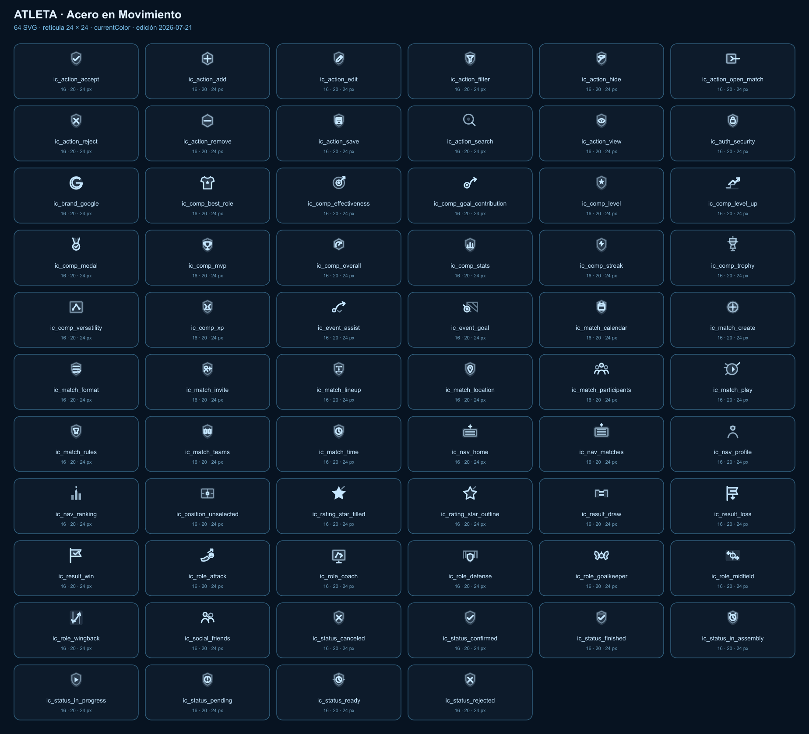
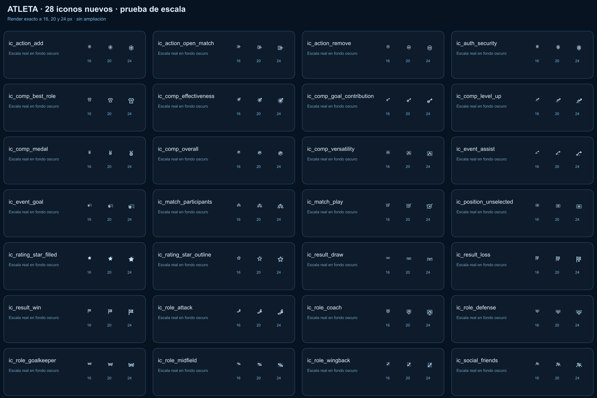
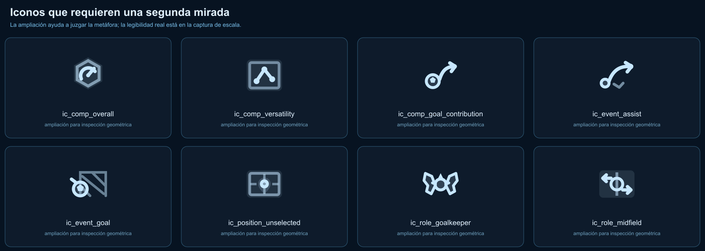

# Revisión visual de iconos nuevos — Atleta

Fecha: 21 de julio de 2026

## Alcance

Revisión del catálogo de 64 SVG y prueba específica de los 28 iconos nuevos a 16, 20 y 24 px sobre el fondo oscuro de la aplicación. Se evaluaron significado, diferenciación, peso óptico, coherencia y riesgos de accesibilidad visibles.

## Veredicto

La dirección `Acero en Movimiento` es correcta y claramente más futbolera que el set inicial. Los iconos nuevos funcionan bien como familia a 20 y 24 px. Antes de declarar el set terminado, conviene refinar seis metáforas y normalizar el tamaño óptico. A 16 px hay pérdidas de detalle que no aparecen en la lámina ampliada.

## Evidencia

### 1. Catálogo completo — salud media-alta

La biblioteca combina correctamente cian hielo, fondo oscuro y contornos metálicos. La transición entre iconos antiguos —con escudo exterior— y nuevos —más pictográficos— todavía se nota. No es un defecto grave, pero sí hace que Acciones y Competición parezcan dos generaciones distintas.

### 2. Prueba 16/20/24 px — salud media

20 y 24 px son tamaños seguros para casi todo el set. A 16 px, los iconos con varios objetos o detalles interiores pierden diferenciación. La lámina general debe dejar de afirmar 16/20/24 px sin mostrar esas tres escalas reales.

### 3. Metáforas críticas ampliadas — requiere refinamiento

La ampliación confirma que la geometría está bien construida, pero también que algunas ideas dependen de detalles demasiado pequeños para uso denso.

## Iconos aprobados

- Acciones: `action_add`, `action_remove`, `action_open_match` y `auth_security`.
- Competición: `best_role`, `effectiveness`, `level_up` y `medal`.
- Rating: estrella llena y vacía.
- Resultados: victoria, empate y derrota como conjunto.
- Roles: Ataque, DT, Defensa y Carrilero.
- Social/partido: Participantes, Amigos y Jugar.

Estos iconos conservan una silueta reconocible y tienen diferencias suficientes entre sí.

## Iconos que deben refinarse

### Prioridad alta

1. `ic_comp_goal_contribution_24.svg` y `ic_event_assist_24.svg`: comparten balón/nodo, curva y flecha. A 16–20 px parecen el mismo icono. G+A debería mostrar dos aportes convergiendo en un balón o marcador; Asistencia debería mostrar un pase inequívoco entre dos jugadores/puntos.
2. `ic_event_goal_24.svg`: balón, trayectoria y portería se superponen. A 16 px puede leerse como un objetivo tachado. Conviene simplificarlo a balón cruzando una línea de gol con dos trazos de red.
3. `ic_role_goalkeeper_24.svg`: a 24 px se reconocen guantes y balón; a 16 px la silueta parece una mariposa. Los guantes necesitan una base más sólida o una portería mínima que ancle el significado.

### Prioridad media

4. `ic_role_midfield_24.svg`: el campo, círculo central y dos flechas explican bien la idea ampliada, pero a 16 px se compactan en una mancha horizontal. Reducir el fondo y enfatizar círculo central + distribución lateral.
5. `ic_comp_versatility_24.svg`: el grafo dentro del rectángulo puede confundirse con analítica. Usar tres puntos claramente ubicados sobre media cancha, evitando que el marco parezca una tarjeta genérica.
6. `ic_position_unselected_24.svg`: funciona a 20–24 px, pero a 16 px se parece a una tarjeta o marcador. Hacer el punto central más grande y eliminar una línea secundaria.

## Ajustes de sistema

- Normalizar tamaño óptico: estrellas y participantes pesan bastante más que `goal_contribution`, `open_match` y `overall`.
- Definir tamaño mínimo por icono: los seis iconos críticos deberían declararse `20 px mínimo` si no se redibujan.
- Mantener el escudo sólo en seguridad, estado e identidad competitiva. Los iconos antiguos todavía lo repiten en demasiadas acciones.
- Actualizar el generador del catálogo para mostrar realmente 16, 20 y 24 px, no una sola representación ampliada.
- Probar estados activo, éxito, error y deshabilitado; esta revisión sólo confirma el estado normal cian sobre fondo oscuro.

## Accesibilidad

- El contraste visible del estado normal es bueno.
- Los resultados se acompañan con texto, evitando dependencia exclusiva del color.
- La captura no permite confirmar foco, área táctil, contraste exacto de estados ni anuncios a lector de pantalla.
- Iconos difíciles a 16 px aumentan la carga de reconocimiento incluso cuando cumplen contraste; claridad de forma y contraste son problemas distintos.

## Recomendación

Hacer una ronda corta de rediseño sólo sobre los seis iconos señalados, normalizar el tamaño óptico de los 28 nuevos y repetir esta misma prueba a 16/20/24 px antes de revisar pantallas autenticadas.
